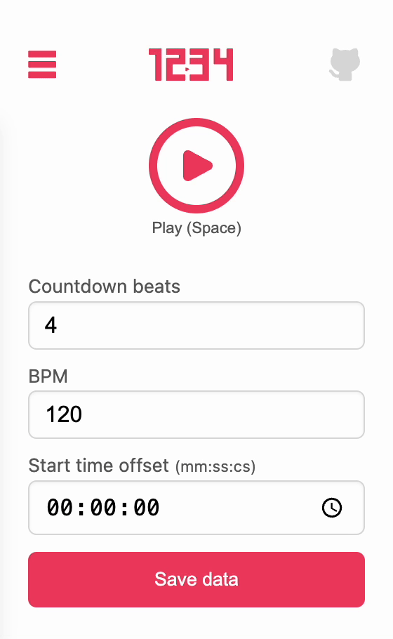

# 1234  

> The 1234 extension adds a customizable countdown to any video. Simply set the count value (N), and the extension will count from 1 to N before playing the video. You can also specify a start time for the video and set a BPM (beats per minute) for the countdown.

## Using the Chrome extension

**Installation**: [Install the extension](https://chromewebstore.google.com/detail/1234/ohalpccdgahgekiagfnldjpicedfcfha) from the Chrome Web Store.

## Features

- Countdown beats: Set the number of beats that will be counted before the video starts.
- BPM: Adjust the speed at which the beats will be counted in beats per minute.
- Start time offset: Set the exact moment the video will start in minutes, seconds, and centiseconds.
- Save settings: Save the settings made for any video. You can reopen videos with the saved settings later on any computer that is synced with your Google Chrome account.

